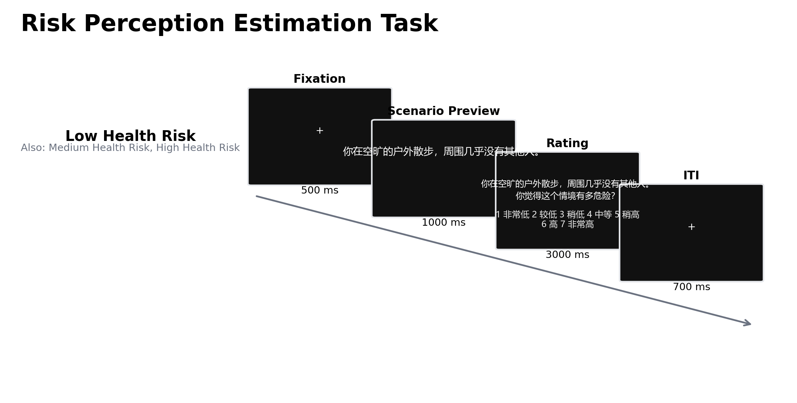

# 情境化健康风险知觉估计任务：测量逻辑、认知神经证据与解释边界

风险知觉研究关注个体如何把事件发生的可能性、潜在损害及其情感意义整合为主观判断。客观概率相同的事件可以引起不同程度的担忧、回避和防护行为，因而仅凭统计风险难以解释现实中的健康决策。情境化风险知觉估计任务（scenario-based risk perception estimation task）以文字、图片或自然场景呈现潜在危害，要求参与者报告主观危险程度或发生可能性，使无法直接观察的风险表征转化为等级评分与反应时。该任务适合检验情境线索、概率表述、后果严重性和社会信息如何改变判断，但单一“危险程度”评分往往同时包含审慎推理、情感反应与既往经验。由此获得的数值应被视为特定刺激和提问方式下的主观评价，而非客观风险知识或稳定风险偏好的直接读数。

## 1. 范式来源与理论背景

该任务没有一篇以“Risk Perception Estimation Task”为固定名称的首创论文，其方法来源是风险知觉的心理测量传统。Fischhoff 等（1978）要求参与者对多类技术与社会危害作量化评价，并证明风险可接受性不能由死亡概率和收益完全说明；“可控性”“陌生性”和灾难性后果等质性属性会系统影响判断。Slovic（1987）据此概括心理测量范式（psychometric paradigm），将个体或群体对危害的评分结构作为风险知觉的经验表征。后续研究进一步区分以概率和后果为基础的分析性加工与快速的情感性评价，两者可以共同决定同一评分（Slovic et al., 2004）。

健康风险研究将这一传统转向个体易感性和预防决策。风险知觉三成分模型（Tripartite Model of Risk Perception, TRIRISK）区分审议性风险，即对患病可能性的判断；情感性风险，即担忧或恐惧；以及经验性风险，即“感觉自己容易患病”的直觉。三者相关但不能相互替代，并可分别解释健康行为意向（Ferrer et al., 2016）。因此，情境评分任务若只询问“有多危险”，所得评分在操作上是综合危险判断。除非同时操控概率与后果、另测情感反应，研究者不能仅凭评分高低判定哪一种成分发生了变化。

## 2. 任务逻辑、流程与核心测量

这一任务族的共同逻辑是先建立短暂基线，再呈现与潜在损害有关的情境，随后在规定窗口内作序数或概率判断。关键操控通常包括事件发生可能性、后果严重性、信息格式、可控性以及社会参照。Coaster 等（2011）将身体伤害的严重性、发生可能性以及频率或概率表述正交变化；Megías 等（2018）使用经驾驶教练预先分级的日常交通场景；Knoll 等（2020）则在初次风险评分后呈现他人评分并要求再次判断。上述变体说明该任务族没有统一的刺激数量、阶段时长、反馈或自适应规则。研究报告必须明确具体版本，不能把某一实验的时序视为通行标准。

情境呈现阶段主要提供语义、概率和后果信息；评分阶段要求将这些信息映射到有限量尺。最直接的因变量是各条件的平均或中位风险评分，核心对比可写为“高风险情境 > 低风险情境”或“高可能性 > 低可能性”。反应时反映形成并输出判断所需的总时间，同时受到阅读难度、按键熟练度、量尺端点使用和速度—准确权衡影响。若设计包含社会信息，初评与复评之差可操作化为社会影响；若提供客观风险基准，主观评分与基准的偏差才可用于讨论校准。没有客观基准时，参与者之间的评分差异不构成正确与错误。

刺激和量尺共同决定构念含义。概率数值便于估计校准，却对数理理解和概率格式敏感；“很低—很高”等序数量尺降低了计算要求，但量尺间距不能默认等距。Woloshin 等（2000）的健康风险量尺研究表明，即便量尺具有可接受的排序效度，其重测相关仍可能仅为中等水平。情境重复可提高单个参与者的观测数量，却不能替代跨情境的刺激抽样。若同一条件始终绑定同一句材料，条件差异同时包含风险等级与刺激措辞差异。

## 3. 主要行为与认知神经科学证据

### 3.1 风险评分与健康行为的关系

行为证据较一致地表明，主观风险评分能够解释部分防护行为，但这种联系不是稳定的单向因果关系。以疫苗接种为例，元分析发现较高风险知觉与接种行为存在总体关联，但不同风险提问方式所得效应并不等同（Brewer et al., 2007）。提高风险评价的实验性干预平均可以改变行为意向和行为，效果还取决于反应效能与自我效能；单纯提高威胁知觉并不足以保证行动（Sheeran et al., 2014）。这些结果支持风险评分的预测效度，同时限制了把评分直接解释为行为准备程度的做法。

感染风险研究显示，情境和时间会持续重塑评分。跨国调查发现 COVID-19 风险知觉与个人经验、价值观、政府信任和防护行为相关，国家间差异明显（Dryhurst et al., 2020）。疫情早期的纵向密集测量显示，风险知觉与防护行为会在短时间内同步变化（Wise et al., 2020）。中美四波研究进一步发现，美国样本中早期风险知觉可预测后续防护行为，持续暴露后行为也会反向预测风险知觉；中国样本中的对应关系较弱，可能受到防控政策和社会规范约束（Li et al., 2022）。因此，横断面上“高评分—多防护”的相关不能确定方向。

情境想象是该任务族的一项方法学发展。Sinclair 等（2021）发现，日常活动的主观感染风险与基于流行率的风险并不充分一致，但仍能预测防护规范遵从；将事实信息与具体后果想象配对可以调整风险评价。该结果说明情境材料能够提高信息的自我相关性，也提示评分变化可能来自情感显著性或可想象性，而不一定来自概率知识改善。

### 3.2 fMRI 与事件相关电位证据

与情境评分直接相关的功能磁共振成像（functional magnetic resonance imaging, fMRI）研究支持分布式加工，而非单一“风险中枢”。在身体伤害文字情境中，严重性、可能性与数字格式分别调节语言加工、前额叶及皮层下区域的血氧水平依赖（blood-oxygen-level-dependent, BOLD）反应；相同风险以频率而非概率表述时还会得到更高行为评分（Coaster et al., 2011）。在自然交通场景中，随预先分级的风险水平升高，岛叶、额下回、感觉运动和视空间相关区域的活动呈线性增强（Megías et al., 2018）。两项研究共同表明，风险评分依赖语义理解、显著性、后果评价和反应映射。条件相关 BOLD 差异不能单独证明某一区域对主观风险具有因果作用。

事件相关电位（event-related potential, ERP）提供了时间进程证据。Schmälzle 等（2012）让参与者根据陌生人面孔评价 HIV 风险，高风险印象相较低风险印象在约 180–240 ms 出现右额区正向调制，并在 450–600 ms 引起更大的晚期正电位，提示外貌线索可以迅速获得情感和注意优先性。该变体测量的是基于面孔的感染风险印象，容易包含刻板印象，不能直接推广到文字健康情境。ERP 的头皮分布也不提供精确的脑区定位。现有 EEG 证据尚不足以为一般文字情境评分建立稳定的成分标志物。

## 4. 范式发展与主要应用

范式发展主要表现为对信息来源和社会过程的分离。概率与严重性正交操控有助于区分“更可能发生”和“后果更严重”；初评—社会信息—复评流程可估计他人意见引起的更新。Knoll 等（2020）发现，青少年比成人更大程度地向他人风险评分调整，意见冲突伴随后内侧额叶和额下回等区域活动增强。该结果把情境评分扩展至发展性社会影响研究，但样本为女性青少年和女性成人，年龄差异不能无条件推广到所有群体。

健康领域应用覆盖传染病、癌症、心血管疾病和糖尿病等主题。近期系统综述显示，非传染性疾病研究使用单题、复合量表和多成分指标，绝对风险、比较风险、终生风险和笼统“感知风险”常被混用（Ling et al., 2023）。糖尿病风险知觉综述纳入的研究中，只有少部分专门检验量表心理测量属性，多数采用横断面设计，且理论指导不足（Rodriguez et al., 2023）。这类任务适合比较实验操控后的群体均值、追踪同一人的状态变化或检验风险信息更新，不宜作为个体临床筛查工具。

## 5. 测量效度与解释边界

构念效度取决于问题措辞与操控是否对应。询问“事件发生概率”主要指向审议性风险；询问“有多担心”主要指向情感性风险；询问“感觉会不会发生在自己身上”更接近经验性风险。笼统危险评分可能同时受三者影响（Ferrer et al., 2016）。若高风险材料还比低风险材料更长、更生动或更熟悉，评分与反应时的条件差异就不能唯一归因于风险水平。量尺端点、数字与言语标签、风险的时间范围以及以“采取防护”还是“不采取防护”为前提，也会改变回答。

可靠性应在目标用途下评估。稳定的条件均值只能说明群体对操控有一致反应，不能保证个体排序稳定。单题评分无法估计内部一致性；少量固定刺激又会夸大对特定材料的依赖。适用于个体差异研究的设计应增加每类独立情境、平衡文本长度和情感强度，并报告试次层级模型、分半或重测信度。若目标是概率校准，还需提供可验证的概率基准；若目标是主观危险感，则不应以专家预设等级充当参与者的“正确答案”。

预测效度同样需要限定。风险知觉与健康行为之间的群体关联会受到知识、行为效能、社会规范、政策约束和既往行为影响（Brewer et al., 2007; Li et al., 2022）。提高评分并不等同于改善决策，过高估计还可能增加焦虑或无效回避。现有证据支持把情境评分作为对刺激与信息表述敏感的研究指标，尚不足以据此作个体诊断、推断稳定人格特征或确认风险知觉对现实行为的单向因果作用。

## 6. TaskBeacon 中的任务实现

### 6.1 任务资源与访问入口

| 资源 | ID | 用途 | 地址 |
|---|---|---|---|
| 完整行为实验源码 | T000036 | PsychoPy/PsyFlow 中文行为任务 | [GitHub](https://github.com/TaskBeacon/T000036-risk-perception-estimation) |
| 浏览器伴随版本源码 | H000036 | 行为型浏览器预览仓库 | [GitHub](https://github.com/TaskBeacon/H000036-risk-perception-estimation) |

上述两个源码仓库的公开地址已核验。H000036 的公开仓库说明将其标为浏览器伴随版本；现有公开元数据未提供可核验的直接运行地址，也不足以确认其试次数与桌面版是否完全一致。因此，浏览器版本宜作为任务体验入口的源码，不应被表述为 T000036 的等价采集版本。

### 6.2 实现流程与关键参数

**图 1. TaskBeacon 当前版本的单试次流程。** 每个试次依次呈现 500 ms 中央注视、1,000 ms 无反应的情境预览、3,000 ms 评分窗口和 700 ms 注视型试次间隔。低、中、高健康风险条件分别映射到“空旷户外且周围几乎无人”“通风室内与少数人短暂停留”和“拥挤室内长时间聚会”三段固定文字；评分阶段再次呈现情境及“你觉得这个情境有多危险？”和 1–7 量尺，1 表示“非常低”，7 表示“非常高”。任务不提供试次正确性或奖励反馈；区块结束后呈现该区平均评分与平均反应时。条件以等权方式随机编排，不使用难度滴定或自适应控制；内部记录的名义目标值 2、4、6 不参与正确性计分。

| 项目 | TaskBeacon 当前设置 |
|---|---|
| 采集与语言 | 行为采集；中文 |
| 区块与试次 | 3 个区块，共 36 个试次，每区块 12 个 |
| 条件 | 低、中、高健康风险；各等级绑定一段固定情境 |
| 时序 | 注视 0.5 s；预览 1.0 s；评分窗口 3.0 s；间隔 0.7 s |
| 反应与因变量 | 数字键 1–7；风险评分、反应时、是否超时 |
| 反馈与控制 | 无试次正确性或奖励反馈；区块显示均值；无自适应算法 |

该实现以主观评分和反应时为主要结果，不设客观正确答案。三种固定情境在每个区块重复出现，因而能够估计同一材料下评分的短时一致性；风险等级与具体文本完全绑定，条件效应不能分离于通风、人数、空间与停留时间等共同变化。区块均值反馈还可能成为后续评分的自我锚定信息。适用于推断一般健康风险知觉的研究应扩充每个等级的独立情境，并预先规定评分汇总、超时处理和刺激层级分析。

## 参考文献

Brewer, N. T., Chapman, G. B., Gibbons, F. X., Gerrard, M., McCaul, K. D., & Weinstein, N. D. (2007). Meta-analysis of the relationship between risk perception and health behavior: The example of vaccination. *Health Psychology, 26*(2), 136–145. https://doi.org/10.1037/0278-6133.26.2.136

Coaster, M., Rogers, B. P., Jones, O. D., Viscusi, W. K., Merkle, K. L., Zald, D. H., & Gore, J. C. (2011). Variables influencing the neural correlates of perceived risk of physical harm. *Cognitive, Affective, & Behavioral Neuroscience, 11*(4), 494–507. https://doi.org/10.3758/s13415-011-0047-9

Dryhurst, S., Schneider, C. R., Kerr, J., Freeman, A. L. J., Recchia, G., van der Bles, A. M., Spiegelhalter, D., & van der Linden, S. (2020). Risk perceptions of COVID-19 around the world. *Journal of Risk Research, 23*(7–8), 994–1006. https://doi.org/10.1080/13669877.2020.1758193

Ferrer, R. A., Klein, W. M. P., Persoskie, A., Avishai-Yitshak, A., & Sheeran, P. (2016). The Tripartite Model of Risk Perception (TRIRISK): Distinguishing deliberative, affective, and experiential components of perceived risk. *Annals of Behavioral Medicine, 50*(5), 653–663. https://doi.org/10.1007/s12160-016-9790-z

Fischhoff, B., Slovic, P., Lichtenstein, S., Read, S., & Combs, B. (1978). How safe is safe enough? A psychometric study of attitudes towards technological risks and benefits. *Policy Sciences, 9*(2), 127–152. https://doi.org/10.1007/BF00143739

Knoll, L. J., Gaule, A., Lazari, A., Jacobs, E. A. K., & Blakemore, S. J. (2020). Neural correlates of social influence on risk perception during development. *Social Neuroscience, 15*(3), 355–367. https://doi.org/10.1080/17470919.2020.1726450

Li, Y., Luan, S., Li, Y., Wu, J., Li, W., & Hertwig, R. (2022). Does risk perception motivate preventive behavior during a pandemic? A longitudinal study in the United States and China. *American Psychologist, 77*(1), 111–123. https://doi.org/10.1037/amp0000885

Ling, M. Y. J., Ahmad, N., & Aizuddin, A. N. (2023). Risk perception of non-communicable diseases: A systematic review on its assessment and associated factors. *PLOS ONE, 18*(6), e0286518. https://doi.org/10.1371/journal.pone.0286518

Megías, A., Cándido, A., Maldonado, A., & Catena, A. (2018). Neural correlates of risk perception as a function of risk level: An approach to the study of risk through a daily life task. *Neuropsychologia, 119*, 464–473. https://doi.org/10.1016/j.neuropsychologia.2018.09.012

Rodriguez, S. A., Tiro, J. A., Baldwin, A. S., Hamilton-Bevil, H., & Bowen, M. (2023). Measurement of perceived risk of developing diabetes mellitus: A systematic literature review. *Journal of General Internal Medicine, 38*(8), 1928–1954. https://doi.org/10.1007/s11606-023-08164-w

Schmälzle, R., Renner, B., & Schupp, H. T. (2012). Neural correlates of perceived risk: The case of HIV. *Social Cognitive and Affective Neuroscience, 7*(6), 667–676. https://doi.org/10.1093/scan/nsr039

Sheeran, P., Harris, P. R., & Epton, T. (2014). Does heightening risk appraisals change people’s intentions and behavior? A meta-analysis of experimental studies. *Psychological Bulletin, 140*(2), 511–543. https://doi.org/10.1037/a0033065

Sinclair, A. H., Hakimi, S., Stanley, M. L., Adcock, R. A., & Samanez-Larkin, G. R. (2021). Pairing facts with imagined consequences improves pandemic-related risk perception. *Proceedings of the National Academy of Sciences, 118*(32), e2100970118. https://doi.org/10.1073/pnas.2100970118

Slovic, P. (1987). Perception of risk. *Science, 236*(4799), 280–285. https://doi.org/10.1126/science.3563507

Slovic, P., Finucane, M. L., Peters, E., & MacGregor, D. G. (2004). Risk as analysis and risk as feelings: Some thoughts about affect, reason, risk, and rationality. *Risk Analysis, 24*(2), 311–322. https://doi.org/10.1111/j.0272-4332.2004.00433.x

Wise, T., Zbozinek, T. D., Michelini, G., Hagan, C. C., & Mobbs, D. (2020). Changes in risk perception and self-reported protective behaviour during the first week of the COVID-19 pandemic in the United States. *Royal Society Open Science, 7*(9), 200742. https://doi.org/10.1098/rsos.200742

Woloshin, S., Schwartz, L. M., Byram, S., Fischhoff, B., & Welch, H. G. (2000). A new scale for assessing perceptions of chance: A validation study. *Medical Decision Making, 20*(3), 298–307. https://doi.org/10.1177/0272989X0002000306
